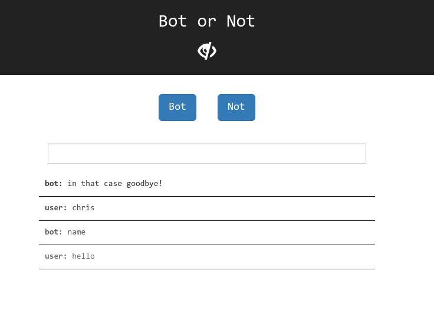

# Roboto or Notto
Chatbot implemented at Hacktech '17 which takes user input and tries to learn to speak in a more "human" way.

The "brains" were written in `Wolfram` language, using the notebooks on the Wolfram Development Platform and its quick API setup feature to get it hooked up to a webpage. The website was written with React, and hosted using Google's App Engine, but is down due to costs.

The bot didn't get very far due to lack of training, and also because this was the first time our team dealt with anything related to machine learning. Nonetheless, we got some fun stuff out of it (read from bottom to top):

## Training files
These are the files passed to a `Classify[]` function to train it to classify speech as "human" or not
- `hamlet/`
 - `hamlet.txt`: _Hamlet_ in plaintext, taken from [gutenberg](http://www.gutenberg.org/ebooks/1524)
 - `assoc_hamlet.txt`: Associations of lines to responses to those lines, taken from the play
 - `hamlet_assoc.py`: A Python script that generates the line associations
- `keypeele/`
 - `chainwax.txt`: Source text from a Key & Peele skit
 - `chainwax_assoc.txt`: Generated associations from the skit
 - `keynpeele_assoc.py`: Python script generating the associations
- `wolfram/`
 - `human_msgs.txt` and `notbotData.txt`: stored messages typed by the user and "approved" generated responses by the bot
 - `bot_msgs.txt` and `botData.txt`: stored generated messages by the bot that were not "approved"
 - `hardcoded.txt`: a hardcoded associative array of responses that was used early on

## `wolfram/` Notebooks:
Note: Sadly, there isn't an easy way to export notebooks as clean plaintext files, so reading them as they are won't be very interesting, unless you have a piece of Wolfram software that can open them.
- `APIClassifyBot.nb`: Used in the API to simply provide a "human" or "bot" classification to given text
- `Evolutionary.nb`: Combines classification (from `APIClassifyBot.nb`) with random text generation using a Markov chain
